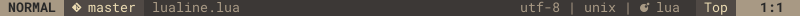

# lualine.nvim
A blazing fast and easy to configure neovim statusline written in pure lua.

`lualine.nvim` requires neovim 0.5
## Screenshots
Here is a preview of how lualine can look like.




## Performance compared to other plugins
Unlike other statusline plugins lualine loads only defined components, nothing else.

Startup time performance measured with an amazing plugin [tweekmonster/startuptime.vim](https://github.com/tweekmonster/startuptime.vim)

| clean vimrc    | lualine      |  airline     |  lightline   |
| :------------: | :----------: | :----------: | :----------: |
|  8.943 ms      | 9.034 ms     | 13.425 ms    | 11.463 ms    |


## Installation
### [vim-plug](https://github.com/junegunn/vim-plug)
```vim
Plug 'hoob3rt/lualine.nvim'
" If you want to have icons in your statusline choose one of these
Plug 'kyazdani42/nvim-web-devicons'
Plug 'ryanoasis/vim-devicons'
```
### [packer.nvim](https://github.com/wbthomason/packer.nvim)
```lua
use {
  'hoob3rt/lualine.nvim',
  requires = {'kyazdani42/nvim-web-devicons', opt = true}
}
```

## Usage and customization
Lualine has sections as shown below.

```
+-------------------------------------------------+
| A | B | C                            X | Y | Z |
+-------------------------------------------------+
```

Each sections holds it's components e.g. current vim's mode.
Colorscheme of sections is mirrored, meaning section `A` will have the same colorscheme as section `Z` etc.

Configuration is currently limited to lua, please use lua block or a separate lua file to configure lualine.

### Starting lualine
```lua
local lualine = require('lualine')
lualine.status()
```
### Setting a theme
```lua
lualine.theme = 'gruvbox'
```

<details>
<summary><b>Available themes</b></summary>

* gruvbox
* dracula

Please create a pr if you managed to port a popular theme before me
</details>

### Changing separator in section
Lualine defines a separator between components in given section, the default
separator is `|`. You can change the separator this way:

```lua
lualine.separator = '|'
```

or disable it

```lua
lualine.separator = ''
```

### Changing components in lualine sections

<details>
<summary><b>Lualine defaults</b></summary>

```lua
lualine.sections = {
  lualine_a = { 'mode' },
  lualine_b = { 'branch' },
  lualine_c = { 'filename' },
  lualine_x = { 'encoding', 'fileformat', 'filetype' },
  lualine_y = { 'progress' },
  lualine_z = { 'location'  },
  lualine_diagnostics = {  }
}

lualine.inactiveSections = {
  lualine_a = {  },
  lualine_b = {  },
  lualine_c = { 'filename' },
  lualine_x = { 'location' },
  lualine_y = {  },
  lualine_z = {   }
}
```

</details>

<details>
<summary><b>Available components</b></summary>

* branch
* encoding
* fileformat
* filename
* filetype
* location
* mode
* progress

</details>

<details>
<summary><b>Using custom functions as lualine component</b></summary>

You can define a custom function as a lualine component

```lua
local function hello()
  return [[hello world]]
end
lualine.sections = { lualine_a = { hello } }
```

</details>

### Loading plugin extensions
Lualine extensions change statusline appearance for a window/buffer with a plugin loaded e.g. [junegunn/fzf.vim](https://github.com/junegunn/fzf.vim)

By default no plugin extension are loaded to improve performance. If you are using a plugin which is supported you can load it this way:
```lua
lualine.extensions = { 'fzf' }
```

<details>
<summary><b>Available extensions</b></summary>

* fzf

Please create a pr if you managed to create an extension before me
</details>

### Full config example using [packer.nvim](https://github.com/wbthomason/packer.nvim)

<details>
<summary><b>packer config</b></summary>

```lua
  use {
    'hoob3rt/lualine.nvim',
    requires = {'kyazdani42/nvim-web-devicons', opt = true},
    config = function()
      local lualine = require('lualine')
      lualine.theme = 'gruvbox'
      lualine.separator = '|'
      lualine.sections = {
        lualine_a = { 'mode' },
        lualine_b = { 'branch' },
        lualine_c = { 'filename' },
        lualine_x = { 'encoding', 'fileformat', 'filetype' },
        lualine_y = { 'progress' },
        lualine_z = { 'location'  },
        lualine_diagnostics = {  }
      }
      lualine.inactiveSections = {
        lualine_a = {  },
        lualine_b = {  },
        lualine_c = { 'filename' },
        lualine_x = { 'location' },
        lualine_y = {  },
        lualine_z = {   }
      }
      lualine.extensions = { 'fzf' }
      lualine.status()
    end
  }
```

</details>

### Full config example inside `.vimrc`/`init.vim`

<details>
<summary><b>vimrc config</b></summary>
  
```vim
lua << EOF
local lualine = require('lualine')
    lualine.theme = 'gruvbox'
    lualine.separator = '|'
    lualine.sections = {
      lualine_a = { 'mode' },
      lualine_b = { 'branch' },
      lualine_c = { 'filename' },
      lualine_x = { 'encoding', 'fileformat', 'filetype' },
      lualine_y = { 'progress' },
      lualine_z = { 'location'  },
      lualine_diagnostics = {  }
    }
    lualine.inactiveSections = {
      lualine_a = {  },
      lualine_b = {  },
      lualine_c = { 'filename' },
      lualine_x = { 'location' },
      lualine_y = {  },
      lualine_z = {   }
    }
    lualine.extensions = { 'fzf' }
    lualine.status()
EOF
```
</details>

### Defining custom themes


<details>
<summary><b>Theme example</b></summary>

To create a custom theme you need to define a colorscheme for each of vim's modes. Each mode has a `fg` and `bg` field for every lualine section.
This is really easy in lua. Here is and example of a gruvbox theme.

```lua
local gruvbox = {  }

local colors = {
  black = "#282828",
  white = '#ebdbb2',
  red = '#fb4934',
  green = '#b8bb26',
  blue = '#83a598',
  yellow = '#fe8019',

  gray = '#a89984',
  darkgray = '#3c3836',

  lightgray = '#504945',
  inactivegray = '#7c6f64',
}

gruvbox.normal = {
  a = {
    bg = colors.gray,
    fg = colors.black,
  },
  b = {
    bg = colors.lightgray,
    fg  = colors.white,
  },
  c = {
    bg = colors.darkgray,
    fg = colors.gray
  }
}

gruvbox.insert = {
  a = {
    bg = colors.blue,
    fg = colors.black,
  },
  b = {
    bg = colors.lightgray,
    fg = colors.white,
  },
  c = {
    bg = colors.lightgray,
    fg = colors.white
  }
}


gruvbox.visual = {
  a = {
    bg = colors.yellow,
    fg = colors.black,
  },
  b = {
    bg = colors.lightgray,
    fg = colors.white,
  },
  c = {
    bg = colors.inactivegray,
    fg = colors.black
  },
}

gruvbox.replace = {
  a = {
    bg = colors.red,
    fg = colors.black,
  },
  b = {
    bg = colors.lightgray,
    fg = colors.white,
  },
  c = {
    bg = colors.black,
    fg = colors.white
  },
}

gruvbox.command = {
  a = {
    bg = colors.green,
    fg = colors.black,
  },
  b = {
    bg = colors.lightgray,
    fg = colors.white,
  },
  c = {
    bg = colors.inactivegray,
    fg = colors.black
  },
}

gruvbox.terminal = gruvbox.normal

gruvbox.inactive = {
  a = {
    bg = colors.darkgray,
    fg = colors.gray,
  },
  b = {
    bg = colors.darkgray,
    fg = colors.gray,
  },
  c = {
    bg = colors.darkgray,
    fg = colors.gray
  },
}

lualine.theme = gruvbox
```

</details>

## TODO's
Please create an issue/ pr if you want to see more functionality implemented
- General
  - [ ] create doc file
- Components
  - [x] branch component
  - [x] file encoding component
  - [x] file format component
  - [x] filename component
  - [x] filetype component
  - [x] location in file component
  - [x] vim mode component
  - [x] file progress component
- Icons usage
  - [x] [ryanoasis/vim-devicons](https://github.com/ryanoasis/vim-devicons)
  - [x] [kyazdani42/nvim-web-devicons](https://github.com/kyazdani42/nvim-web-devicons)
- Plugin Extensions
  - [x] [junegunn/fzf.vim](https://github.com/junegunn/fzf.vim)
  - [ ] [tpope/vim-fugitive](https://github.com/tpope/vim-fugitive)
  - [ ] [junegunn/goyo.vim](https://github.com/junegunn/goyo.vim)
  - [ ] [preservim/nerdtree](https://github.com/preservim/nerdtree)
  - [ ] [kyazdani42/nvim-tree.lua](https://github.com/kyazdani42/nvim-tree.lua)
  - [ ] [ms-jpq/chadtree](https://github.com/ms-jpq/chadtree)
  - [ ] [liuchengxu/vista.vim](https://github.com/liuchengxu/vista.vim)
  - [ ] [preservim/tagbar](https://github.com/preservim/tagbar)
- Plugin Components
  - [ ] [vim-signify](https://github.com/mhinz/vim-signify)
- Diagnostics
  - [ ] nvim-lsp status support
  - [ ] [coc.nvim](https://github.com/neoclide/coc.nvim)
  - [ ] [dense-analysis/ale](https://github.com/dense-analysis/ale)
- Themes
  - [ ] support for `notermguicolors`
  - [ ] nord theme
